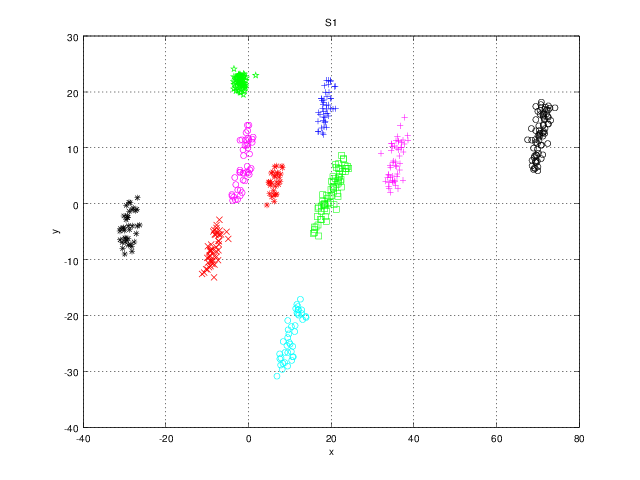
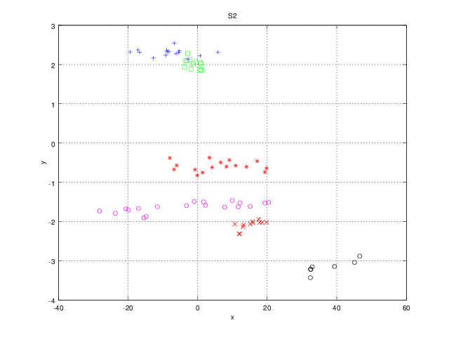
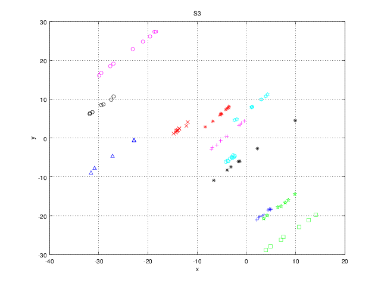
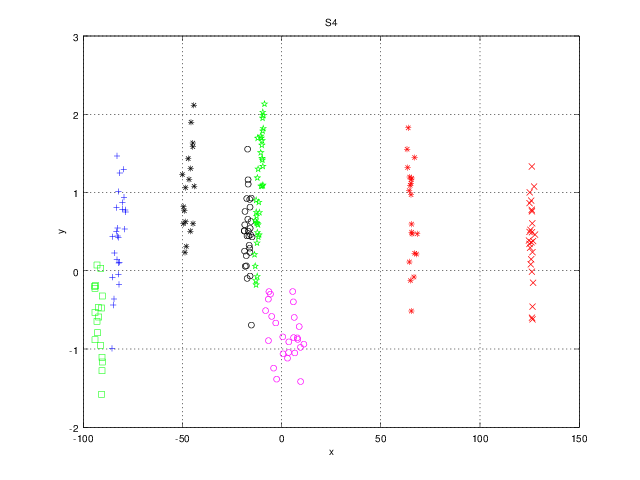
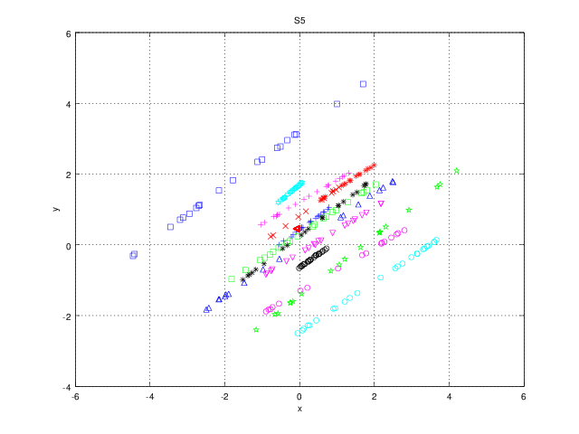
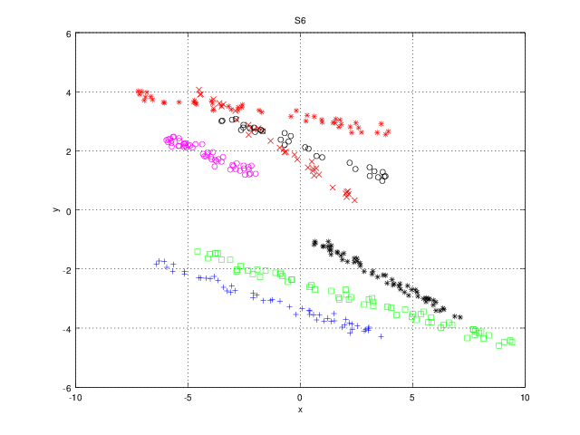

## Summary

The following 2D data sets were produced using the 
[generateData](https://github.com/FakenMC/generateData) script and used
for clustering benchmark in the following publication:

-   Fachada, N., Figueiredo, M.A.T., Lopes, V.V., Martins, R.C., Rosa, 
A.C., [Spectrometric differentiation of yeast strains using minimum volume 
increase and minimum direction change clustering criteria](http://www.sciencedirect.com/science/article/pii/S0167865514000889),
Pattern Recognition Letters, vol. 45, pp. 55-61 (2014), doi: http://dx.doi.org/10.1016/j.patrec.2014.03.008

If you use these data sets please reference the above paper.

## Datasets

### S1

  Parameter            | Value
  -------------------- | -----
  *Slope*              | 3
  *Number of clusters* | 10
  *Total points*       | 500

### S2

  Parameter            | Value
  -------------------- | -----
  *Slope*              | 0.01
  *Number of clusters* | 6
  *Total points*       | 80

### S3

  Parameter            | Value
  -------------------- | -----
  *Slope*              | 1
  *Number of clusters* | 12
  *Total points*       | 100

### S4

  Parameter            | Value
  -------------------- | -----
  *Slope*              | 0
  *Number of clusters* | 8
  *Total points*       | 200

### S5

  Parameter            | Value
  -------------------- | -----
  *Slope*              | 0.75
  *Number of clusters* | 15
  *Total points*       | 300

### S6

  Parameter            | Value
  -------------------- | -----
  *Slope*              | -0.25
  *Number of clusters* | 7
  *Total points*       | 350

## Plotting in Octave/Matlab

The following sequence of commands creates a plot of the S1 data set.
First, load the data set and the clustering layout:

    load S1.csv
    load S1_clusters.csv

It's possible to plot directly using the built-in `scatter` function,
with help from the [seqclusts2idx](https://github.com/FakenMC/amvidc/blob/master/seqclusts2idx.m) 
function:

    scatter(S1(:,1), S2(:,2), size(S1_clusters, 1), seqclusts2idx(S1_clusters)

Another option is to use the [plotClusters](https://github.com/FakenMC/amvidc/blob/master/plotClusters.m) 
function:

    plotClusters(S1, 2, S1_clusters)

